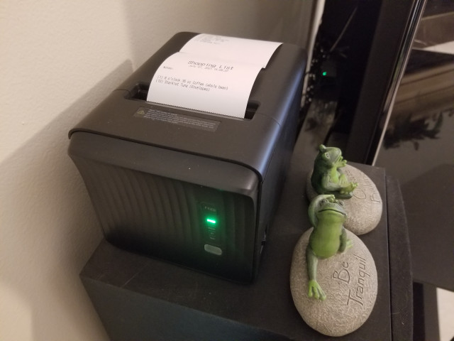

# shoppingList

#### v1.8 adds list title options, smoother overall functioning

I wanted SL to generally create a list title from the filename of the database I had loaded, so now that option exists in the Configuration menu.  I tweaked some other stuff here and there, too, in order to make getting from point A to B easier.

And, in between 1.7 and 1.8 I added a button that opens your database for editing in the system default application for spreadsheets.  I like that.

#### v1.7 improves word-wrap

The Notes section did alright with wrapping, but in the actual list itself, not so much.  So now, items in the list that are longer than the paper is wide are wrapped and indented on the second and subsequent lines.

#### v1.6 introduces the automatic PDF backup list.

ShoppingList is a no-cloud solution to your shopping woes. Private, secure and convenient, ShoppingList is revolutionizing the experience of the mundane grocery or Home Depot run.

ShoppingList is written for Windows in Python. Tkinter is the Python module that creates the graphical interface.

ShoppingList ('SL' from here on) reads from an LibreOffice Calc or Excel .xlsx file. It displays your compiled list in a window, and just to the right of it, gives you a space to type notes you want to appear on the final printed list.

SL reads data from the first four columns.  The first column must be named 'Qty', which is short for Quantity. Maybe in future releases that will be configurable, but for now, it seems like a pretty basic category to use for this sort of thing.

## THE COOLEST PART: The Printer.

SL is intended for use with a networked 80mm ESC/POS receipt printer. There are many under a hundred bucks to choose from. No more carrying that $900.00 phone around in your hand while navigating the treacherous aisles of your local grocery store.  Instead, your list is on a small piece of paper that won't break if it gets dropped.

The python-escpos module is used to interface to with the printer.  It contains support for serial and USB protocols as well as network, but network is so simple that it is currently the default transport protocol. Perhaps in the future the other protocols can be added.

THE FILE MENU: There are three options: Configure, Select Database, and Exit.  
 - Configure lets you set the IP address for the receipt printer as well as set your own title text for the top of your printed shopping list.  This is stored in ShoppingList.ini which is in the same folder with ShoppingList.exe.
    - When you set the title text, try to keep it less than around 20 characters long.
 - Select Database opens a Windows file selection dialog.  When you click on the file of your choice, the location of that file is saved in ShoppingList.ini.

SL optionally creates a PDF version of your list when you print. This file is saved in the folder where your Shopping List .xlsx file is. 

You can actually use SL without a receipt printer by leaving the IP address at 192.168.254.254.  Select 'File/Configure' to set the IP address.

## FUNCTIONS EXPLAINED:

 - RELOAD: Once you've selected your database file and set your printer IP address, it's time to add some stuff to your list.  In your .xlsx database (aka, spreadsheet), add the quantities in the Qty column to the things you need to buy.  If you have SL open, after saving the database file you can press the 'Reload' button and your list will be displayed in the 'Selected items' box. In this way you can keep track of what you have added to your list as you go.

 - CLEAR ALL: If you want to clear your selections from your database after printing your list, there are two steps:  1) Check the 'Clear All Qtys' checkbox, and 2) press the 'Clear All' button.  If you press the button without checking the box,your selections will NOT be cleared, and you will see a info box telling you just that.

 - PRINT: This . . . well, it prints your list.  Afterwards you will see a box asking if you want to exit or not.  If you exit, your current selections will be retained in the database.  If you want to remove them, select 'No' and go back and use the Clear All function to remove them.

I compiled this using pyInstaller.  I chose the 1-Folder option rather than the 1-File option because it seems to load and run quicker.  

The installer is built using Inno Installer Compiler.  Installation and removal is just like any other Windows app.  

You can always find the current version number in the 'About' dialog.

